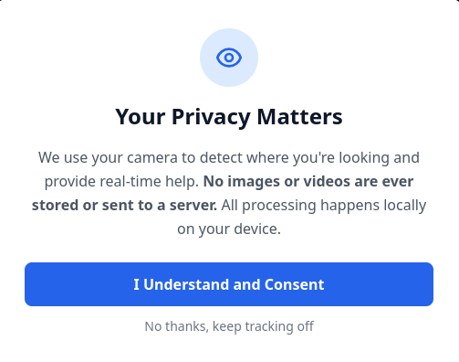
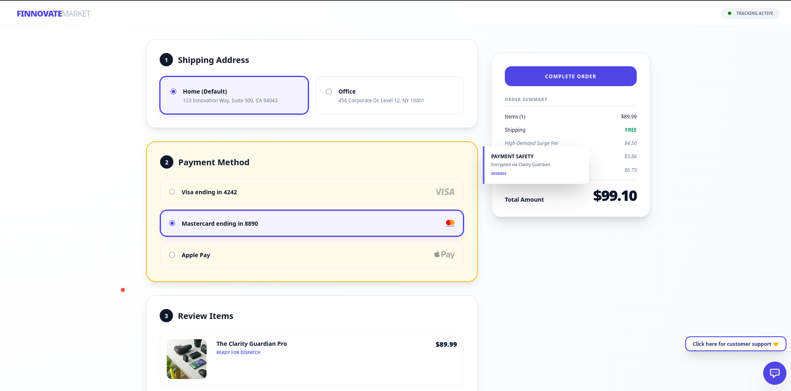
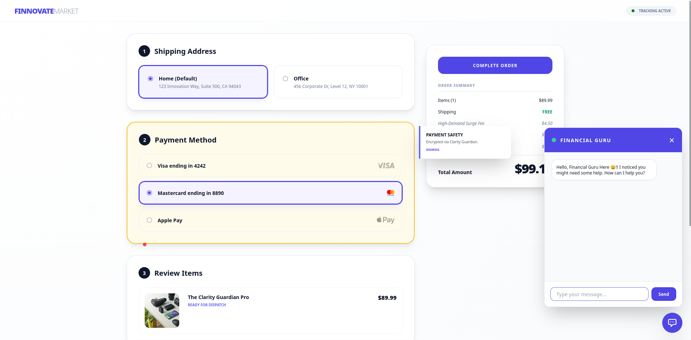

# The Clarity Guardian

The Clarity Guardian is an AI-powered checkout assistant designed to combat "confusion paralysis" in digital commerce. By leveraging real-time eye-tracking technology, the system detects when a user is struggling with complex financial terms or hidden fees and intervenes with contextual help to prevent cart abandonment and reduce future disputes.

## 1. Problem Statement

Payment screens are high-stakes environments. When users encounter complex checkout flows, unexpected fees, or confusing legal jargon, they often hesitate, reading and re-reading the same sections. This behavior, known as confusion paralysis, significantly increases cart abandonment rates. Conversely, frustrated users may simply click through without understanding, which leads to costly chargebacks and customer service disputes later.

## 2. Our Approach: The Confusion Algorithm

The system monitors eye movements via a standard webcam to identify physiological patterns associated with confusion:

- Fixations (Dwell Time): Monitoring how long a user's gaze remains stuck on a specific element (e.g., a "Regulatory Compliance" fee).

- Regression Reading (Revisits): Identifying when a user repeatedly returns to the same block of text.

- Erratic Saccades: Measuring rapid, high-distance eye jumps between distant elements, indicating a search for missing information.

### Trigger Thresholds

A "Confusion Hotspot" is flagged when a specific UI zone records:

1.  More than 5 seconds of total dwell time.

2.  More than 3 revisits to the same area.

3.  accade Strength > 15 (total distance > 6000 pixels).

## 3. Key Features
### 👁️ Real-time Eye Tracking

Utilizes WebGaze.js to map gaze coordinates directly in the browser. The system includes a 9-point calibration process to ensure accuracy for each unique user.
⚡ Adaptive UI Interventions

When confusion is detected, the UI dynamically responds:

- Visual Cues: Highlighting the confusing element with a yellow pulse border.

- Contextual Tooltips: Popping up explanatory text tailored to the specific zone (e.g., "Pricing Detail" or "Payment Safety").

### 🤖 Gemini-Powered "Financial Guru"

If confusion persists for more than 15 seconds, the system escalates to a human-like assistant. Powered by the Google Gemini API, this chatbot provides natural language answers to user concerns regarding fees and shipping.
### 🛡️ Privacy-First Design

Biometric data is highly sensitive. The Clarity Guardian processes all eye-tracking data locally on the user's device; no images or videos are ever stored or sent to a server. Users must provide explicit consent through a privacy modal before tracking begins.
## 4. Product Screenshots
### Privacy & Consent
Users are greeted with a clear disclosure regarding how their data is used and processed locally.

### Gaze Calibration
To ensure accuracy, users follow a 9-dot calibration sequence.

### Real-Time Intervention
The system detects confusion on specific checkout zones and highlights them.

### AI-Assistant Escalation
If confusion persists, the Gemini-powered chat provides immediate clarity.

## 5. Tech Stack

- Frontend: HTML5, CSS3 (Tailwind CSS)

- Logic: JavaScript (ES6+)

- Eye Tracking: WebGaze.js

- AI Integration: Google Gemini API (gemini-2.0-flash-lite)

## 6. Local Setup Instructions

### Follow these steps to run the project on your local machine:

### Clone the Repository:
    
    Bash

    git clone https://github.com/SubhamJM/Payment_confusion_detector_sms

### Launch the Application:

    VS Code Users: Right-click index.html and select "Open with Live Server".

### Usage:

- Accept the Privacy Consent.

- Complete the 9-dot calibration (click each red dot 5 times until it turns green).

- Stare at the any portion of webpage for 5 seconds to trigger the AI response.
